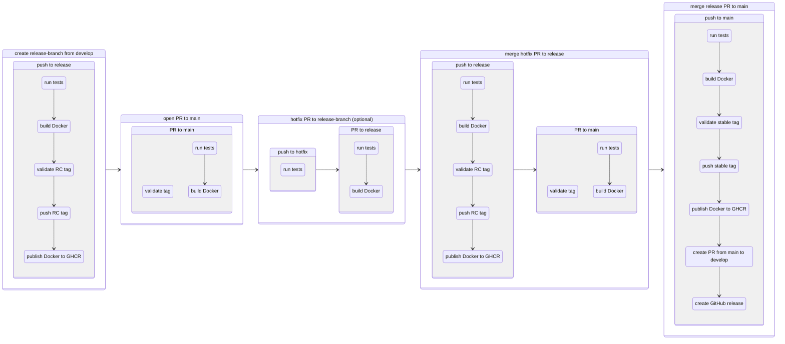

# Release process
## Workflow diagram
- The third and fourth steps are optional and apply only if a runtime error is identified during RC1 validation, requiring a hotfix to be applied to the release branch.
- Opening a PR to `main` can be done either immediately or after testing—both approaches are acceptable.



## Testing steps

#### 1. Create a release branch and push it to github
```
git checkout -b release/1.6.6 develop
git push origin release/1.6.6
```
> [!info] triggers push to release action:
> - runs tests
> - builds docker
> - validates version
> - creates RC tag
> - publishes RC1 package with RC1 and `UAT` tags
> - check https://github.com/ank1m/batchee/pkgs/container/batchee

#### 2. Create PR to `main` branch: https://github.com/ank1m/batchee/compare/main...release/1.6.6
> [!info] triggers PR to main action:
> - runs tests
> - builds docker
> - validates version

#### 3. If bug is found during RC1 validation, open bugfix branch and create PR to `release` branch

##### 3.1 Create `bugfix` branch, push the fix
```
git checkout -b bugfix/test release/1.6.6
git commit --allow-empty -m "fixing some imaginary error"
git push origin bugfix/test
```
> [!info] triggers push to bugfix action:
> - runs tests

##### 3.2 Create PR to `release` branch: https://github.com/ank1m/batchee/compare/release/1.6.6...bugfix/test
> [!info] triggers PR to bugfix action:
> - runs tests
> - builds docker

#### 4 Merge PR
> [!info] triggers push to release action:
> - runs tests
> - builds docker
> - validates version
> - creates next RC tag
> - publishes package with next RC tag and updates `UAT` tag
> - check https://github.com/ank1m/batchee/pkgs/container/batchee

> [!info] also re-triggers PR to main action if PR was submitted, see #2

#### 5 Merge PR from `release` branch to `main`
> [!info] triggers push to main action:
> - runs tests
> - builds docker
> - validates version
> - creates stable tag
> - publishes package with stable tag, `OPS`, and `latest` tags
> - check https://github.com/ank1m/batchee/pkgs/container/batchee
> - creates auto-PR to backmerge `main` to `develop`: https://github.com/ank1m/batchee/pulls
> - creates GitHub release with auto-generated notes: https://github.com/ank1m/batchee/releases

#### 6 Approve and Merge auto-PR to backmerge `main` to `develop`
